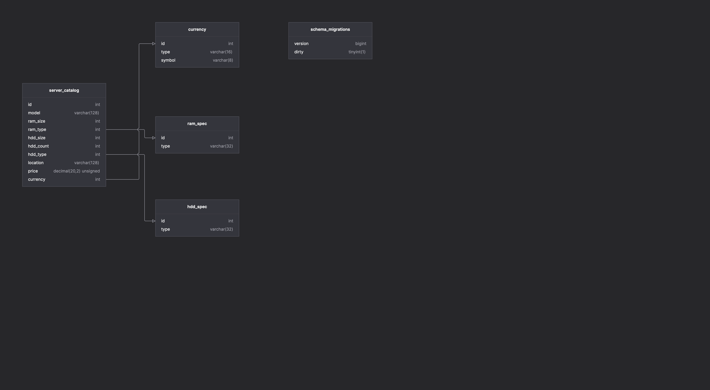

# server-catalog
Server Catalog made for a part of Leaseweb Technical Assessment.

## 📋 Prerequisites

- Go 1.18 or higher
- Docker and Docker Compose
- Make (for using Makefile commands)

## ⚠️ Port Requirements

Before running the application, ensure that:
- Port 3306 is available for MySQL database
- Port 8080 is available for the API server

### Port 3306
The MySQL database runs on port 3306 inside the Docker container. This port must be free on your system. If you have another MySQL instance running, you'll need to stop it first.

## 🛠️ Installation

1. Clone the repository:
```bash
git clone git@github.com:FedTheBug/server-catalog.git
cd server-catalog
```

2. Start the application:
```bash
make build-run
```

## 🏗️ Project Structure
 - api/ # API handlers and routes
 - cmd/ # Command-line interface
 - db/ # Database migrations
 - docs/ # Swagger documentation
 - internal/ # Internal packages
 - middleware/ # HTTP middleware
 - models/ # Data models
 - repository/ # Database repositories
 - transformer/ # Data transformers
 - usecase/ # Business logic

## 🚀 Usage

### API Documentation

Once the server is running, you can access the Swagger documentation at: `http://localhost:8080/swagger/index.html`
- Make sure to authorize before hitting the endpoints using the `app-key` provided below.


## `app-key: PPTjT3ApHD`

## 📊 Database Schema

### 

### Available Make Commands

- `make build-run`: Build and run the application
- `make clean`: Clean up Docker containers and built files

### Running Tests

1. Run all tests:
```bash
go test -v ./...
```

2. Run tests with coverage:
```bash
go test -v -cover ./...
```

3. Run specific package tests:
```bash
# Run repository tests
go test -v ./repository

# Run with coverage for repository
go test -v -cover ./repository
```